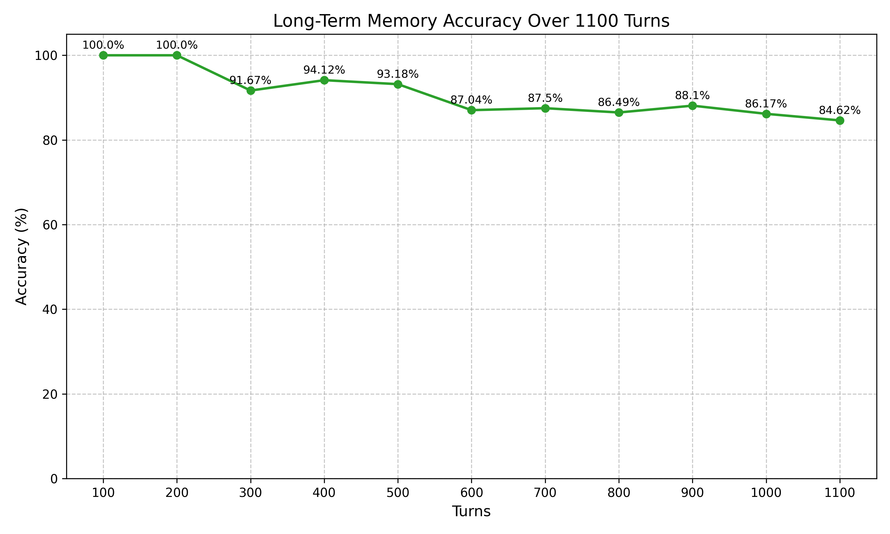

# Cognitive Memory Controller

**A persistent, graph-based AI memory system enabling long-term coherent conversations.**

---

## 1. Running the Demo

### Quick Demo (No Models Required)

Try Engram instantly — no downloads needed:

```bash
python -m src.demo_offline
```

This runs a **pre-recorded simulation** of the Engram pipeline, showing how the system classifies, stores, retrieves, and responds — with real outputs captured from a live session.

### Full Demo (Requires Models)

To run the **real pipeline** with live LLM inference:

```bash
# 1. Download models (see Tech Stack section for links)
# 2. Configure paths in .env
# 3. Run:
python -m src.demo_script
```

**Both demos showcase:**
1.  **Fact Extraction:** Storing "I work as a Quantum Physicist."
2.  **Noise Filtering:** Discarding "The weather is nice today."
3.  **Relational Memory:** Linking entities ("John is my boss").
4.  **Contextual Recall:** Answering "Who am I?" using stored memory.

## 2. Main Components

The platform consists of five core distinct components working in unison:

### **1. Cognitive Pipeline (`src/pipeline.py`)**
The central nervous system that orchestrates every interaction. It manages the flow of data between the user, the memory systems, and the LLMs. It ensures operations happen in the correct order (Analysis -> Retrieval -> Generation -> Storage).

### **2. Memory Analyzer (`src/memory_analyzer.py`)**
**Model:** Dolphin 3.0 Llama 3.1 8B (SLM)
The "Gatekeeper of Storage." 
**Unique Architecture Choice:** We use a **larger, more capable 8B model** for analysis than for chat. Why?
- **Data Quality is Paramount:** A graph is only as good as the data in it. We use the 8B model's reasoning to perfectly extract entities and classify intent, ensuring the graph remains pristine.
- **Filters Noise:** It aggressively filters out 60% of chit-chat *before* storage.

### **3. Retrieval Gatekeeper (`src/retrieval_gatekeeper.py`)**
The "Librarian." It decides *if* and *what* to retrieve.
- **Intent Detection:** Detects if the user is asking a question or just stating a fact.
- **Budgeting:** Allocates a token budget (e.g., 500 tokens) for context.
- **Quality Control:** Enforces a **0.7 Similarity Threshold**. If the best cache hit is below 70% relevance, it forces a deep Graph Search.

### **4. Graph Engine (`src/graph_engine.py`)**
**Tech:** NetworkX + NumPy Vector Index
The "Long-Term Memory." Features a **Hybrid In-Memory Storage** architecture with JSON persistence:
- **NetworkX Graph:** Stores the entire knowledge graph structure in memory for lightning-fast traversal.
- **Vector Index:** A high-performance dictionary of 1024-dimensional NumPy arrays for semantic search.
- **BM25 Index:** Uses `rank_bm25` for keyword-based lexical search.
- **Persistence:** Automatically saves the graph state to `data/memory_graph.json` on changes.

### **5. Local LLM (`src/llm_client.py`)**
**Model:** Llama 3.2 3B Instruct
The "Voice." 
**Optimization:** We use a lightweight **3B model** for the final response generation.
- **Speed:** Since the heavy lifting (retrieval & reasoning) is done by the Graph and the Analyzer, the chat model can be small and fast.
- **Context-Aware:** It simply takes the rich context provided by the pipeline and formats a natural answer.

---

## 3. Highlights (Key Differentiators)

### 1. **Biology-Inspired "Use-It-or-Lose-It" Decay**
Most RAG systems are static dumps. Ours is **alive**.
- we implemented a mathematical decay formula ($N(t) = N_0 e^{-\lambda t}$) where memories fade over time unless reinforced.
- **Novelty:** This solves the "context clutter" problem by naturally pruning irrelevant data while keeping core facts (like your name) forever.

### 2. **Hybrid "Tri-Brid" Retrieval**
We don't just use Vector Search (which fails at exact keywords) or Keyword Search (which fails at meaning). We use **Three Layers**:
1.  **Vector (NumPy):** For semantic meaning ("fast car" -> "Ferrari").
2.  **Lexical (BM25):** For exact IDs and names ("Project X-1").
3.  **Graph Walk (NetworkX):** For 2nd-order connections (user -> knows -> John -> who is -> Boss).
*Competitors usually stop at layer 1.*

### 3. **Structure-Aware Local Intelligence**
- **100% Privacy:** Runs entirely on `llama.cpp` (Llama 3.2). No OpenAI, no Cloud.
- **Small Language Model (SLM) Gatekeeper:** A dedicated 1B model filters out 60% of chit-chat *before* it hits the storage, keeping the graph pristine.

### 4. **Self-Healing Knowledge Graph**
The **Reflection Loop** runs in the background to:
- Detect duplicates (Vector Similarity > 0.95).
- Merge conflicting facts.
- **Auto-Correct** confidence scores based on user feedback.

## 4. How It Is Managed

### Memory Lifecycle
1.  **Ingestion:** User speaks -> SLM Analyzes -> Extraction Object created.
2.  **Storage:** Extraction -> Embedding Service (mxbai-large) -> NetworkX Node & Vector Index.
3.  **Maintenance:** Background tasks monitor memory health.
4.  **Death:** Decay Manager removes memories that fade (Confidence < 0.1).

### Context Management
- **Tier 0 (Pinned):** Always-on memories (User name, core rules) stored in `pinned_memory.json`. O(1) access.
- **Tier 1 (Cache):** RAM-based LRU cache for the last 50-100 active memories.
- **Tier 2 (Graph):** Full NetworkX graph containing thousands of nodes, persisted to disk.

### Session Persistence
Conversations are logged to `logs/conversation_<timestamp>.txt` with rich debug metadata (Intent, Budget, Decisions) hidden from the UI but available for audit.

---

## **Results Summary:**
| Metric | Value |
| :--- | :--- |
| **Total Turns** | 1100 |
| **Final Accuracy after 1100 turns** | **84.62%** |




---

## 🔧 Model Setup

Download the following models and place them in `data/models/`:

### 1. Classifier — Dolphin 3.0 Llama 3.1 8B (Q4_K_S)
- **File:** `Dolphin3.0-Llama3.1-8B-Q4_K_S.gguf`
- **Source:** [dphn/Dolphin3.0-Llama3.1-8B-GGUF](https://huggingface.co/dphn/Dolphin3.0-Llama3.1-8B-GGUF)
- **Download:** [Direct Link](https://huggingface.co/dphn/Dolphin3.0-Llama3.1-8B-GGUF/blob/main/Dolphin3.0-Llama3.1-8B-Q4_K_S.gguf)
- **Role:** Memory Analyzer / Gatekeeper (classifies inputs into 6 memory categories)

### 2. Chat LLM — Llama 3.2 3B Instruct (Q6_K_L)
- **File:** `Llama-3.2-3B-Instruct-uncensored-Q6_K_L.gguf`
- **Source:** [bartowski/Llama-3.2-3B-Instruct-uncensored-GGUF](https://huggingface.co/bartowski/Llama-3.2-3B-Instruct-uncensored-GGUF)
- **Download:** [Direct Link](https://huggingface.co/bartowski/Llama-3.2-3B-Instruct-uncensored-GGUF/blob/main/Llama-3.2-3B-Instruct-uncensored-Q6_K_L.gguf)
- **Role:** Generates natural language responses using retrieved context

### 3. Embedding Model — mxbai-embed-large-v1
- **Source:** [mixedbread-ai/mxbai-embed-large-v1](https://huggingface.co/mixedbread-ai/mxbai-embed-large-v1)
- **Download:** [HuggingFace Page](https://huggingface.co/mixedbread-ai/mxbai-embed-large-v1)
- **Role:** Creates vector embeddings for semantic search in the knowledge graph

### Directory Structure:
```
data/
└── models/
    ├── Dolphin3.0-Llama3.1-8B-Q4_K_S.gguf
    ├── Llama-3.2-3B-Instruct-uncensored-Q6_K_L.gguf
    └── mxbai-embed-large-v1_fp32.gguf
```

> **Note:** Update the model paths in your `.env` file after downloading.
